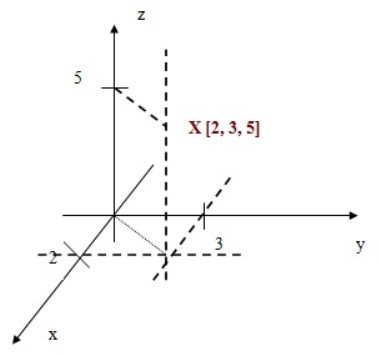

# Matice n-rozmerov

V balíku NumPy je hlavným objektom homogénne viacrozmerné pole. Predstavuje tabuľku prvkov (zvyčajne čísel) rovnakého typu. Takáto tabuľka reprezentuje indexovanú n-ticu nezáporných čísel. Podobne ako aj vo Fyzike, tak aj v NumPy jednotlivé rozmery nazývame osi.

Pre príklad, máme objekt ktorý je definovaný v trojdimenzionalnom priestore súradnicami X,Y,Z. Pre každú súradnicu sa vyskytuje v nejakom bode. Objekt X[2,3,5] teda vieme zakresliť takto:

